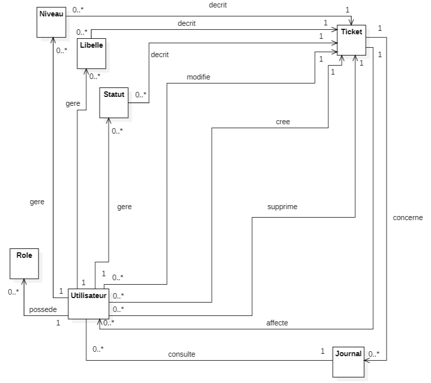
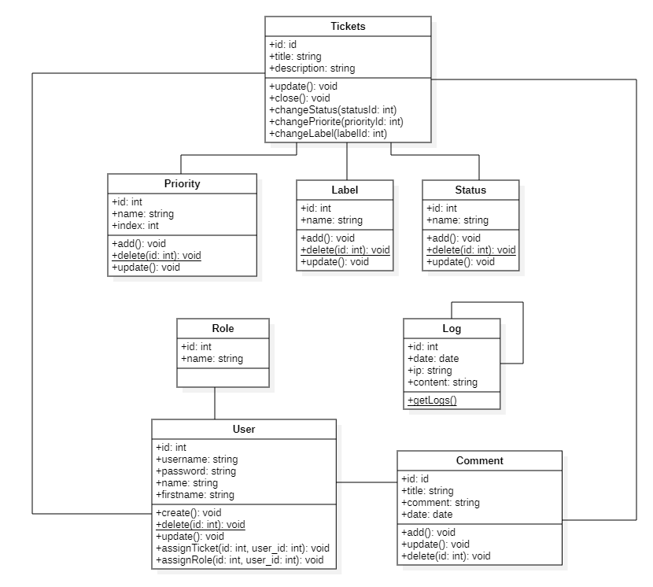

# CONCEPTION  

> FA2 | BARKER, OUALI, GUILLERAY, GRAVIER, LEMOUTON  

## Modèle de conception de base de données  

### Modèle relationnel  

  

### Modèle logique  

roles (__role_id__, role_name)  
priorities (__prio_id__, prio_name, prio_index)  
label (__labe_id__, labe_name)  
status (__stat_id__, stat_name)  
users (__user_id__, user_username, user_password, user_name, user_firstname, #role_id)  
ticket (__tick_id__, tick_title, tick_description, #author_id, #label_id, #priority_id, #status_id, #updater_id, date_creation, date_update)  
logs (__log_id__, log_date, log_ip, log_content, #tick_id, #user_id)  
comments (__com_id__, com_title, com_comment, com_date, #ticket_id, #user_id, #reply_to)  

## Diagramme de Classe

Pour créer le diagramme de classe, nous avons utilisé les tables données précédemment. Grâce aux liaisons entre elles,
nous avons pu les lier avec des associations.  

Nous avons créé la classe "Role" abstraction de "Utilisateur" pour permettre à l'utilisateur de posséder un rôle. 
Ainsi, on peut appliquer les caractéristiques de chaque utilisateur à un rôle.  

Ensuite, nous avons ajouté les classes "Niveau", "Libelle" et "Statut" abstraction de la classe "Utilisateur" pour que 
l'utilisateur puisse gérer les différents aspects qui définissent les tickets.

Aussi, nous avons introduit la classe "Tickets" abstraction des classes "Niveau", "Libelle", "Statut", "Utilisateur" 
afin que les tickets soient caractérisés et attribués.  

De plus, nous avons déclaré la classe "Journal" abstraction de "Ticket" afin de retrouver tous les tickets dans le 
journal.  

Nous avons aussi créé la classe "Comment" abstraction de "Utilisateur" qui sert pour la description du ticket.

## Diagramme de Classe Détaillé

Afin de pouvoir commencer la programmation, nous avons détaillé les classes que nous avons besoin.  
Nous avons aussi détaillé les classes en renseignant les différents champs et les méthodes utiles au développement  

Dans ce diagramme, nous avons détaillé les classes en ajoutant les méthodes et les champs.

> FA2 | BARKER, OUALI, GUILLERAY, GRAVIER, LEMOUTON  