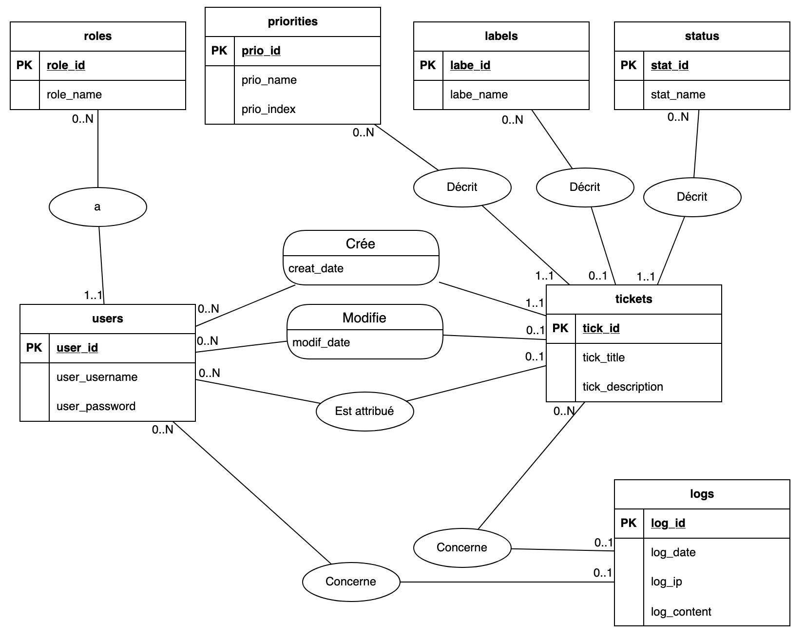
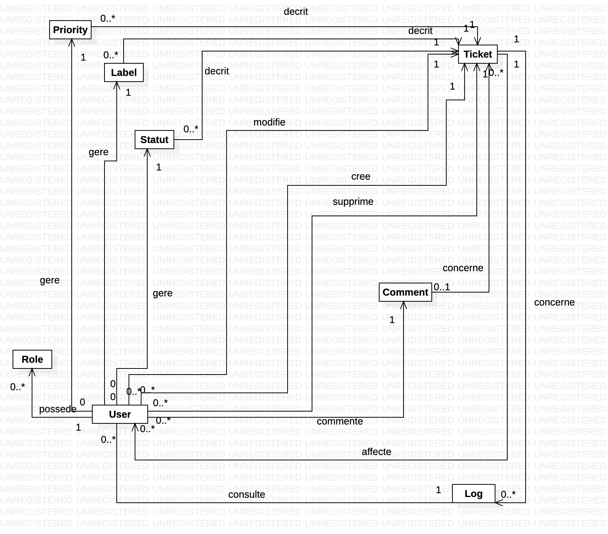
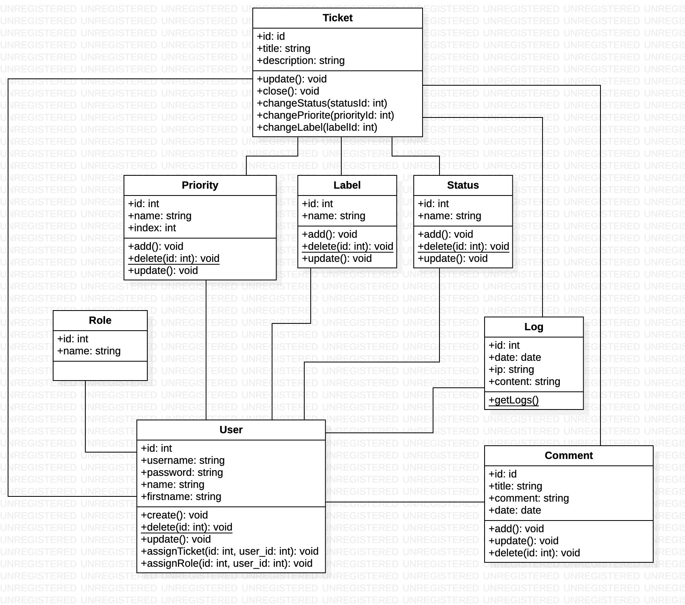
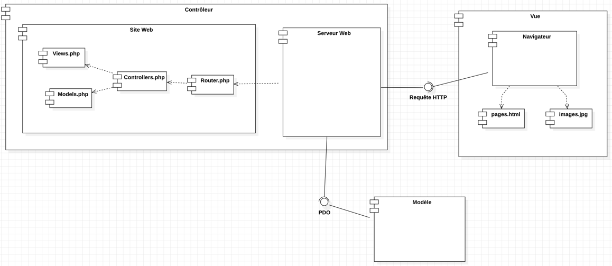

# CONCEPTION  

> FA2 | BARKER, OUALI, GUILLERAY, GRAVIER, LEMOUTON  

## Modèle de conception de base de données  

### Modèle relationnel  

  
Figure 1 : Modèle relationnel de base de données  

### Modèle logique  

roles (__role_id__, role_name)  
priorities (__prio_id__, prio_name, prio_index)  
label (__labe_id__, labe_name)  
status (__stat_id__, stat_name)  
users (__user_id__, user_username, user_password, user_name, user_firstname, #role_id)  
ticket (__tick_id__, tick_title, tick_description, #author_id, #label_id, #priority_id, #status_id, #updater_id, date_creation, date_update)  
logs (__log_id__, log_date, log_ip, log_content, #tick_id, #user_id)  
comments (__com_id__, com_title, com_comment, com_date, #ticket_id, #user_id, #reply_to)  

## Diagramme de Classe

| Objet | Etat | Comportement |
|-------|------|--------------|
| plateforme | en ligne   utilisateur   administeur système   administrateur web   technicien   visiteur | - permet d'établir des requêtes de dépannage, d'amélioration et de fonctionnalité   - fournit les journaux de l'application à l'administrateur système |
| ticket | nature du problème   niveau d'urgence   demandeur   ont un technicien attribué | |
| utilisateur | ont un rôle   ont un mot de passe | - peut changer leur mot de passe   - fait une demande de dépannage (ouvrir un ticket)   - accède à son profil   - se déconnecte |
| requête | | |
| dépannage | | |
| amélioration | | |
| fonctionnalité | | |
| acteur | est un administrateur système   est un administrateur web   est un technicien   est un utilisateur   est un visiteur | accède aux pages |
| administrateur système | | - accède aux journaux d'activités   - manipule les données statistiques |
| administrateur web | | - gère la liste des libellés   - définit les status des tickets   - définit les niveaux d'urgence   - crée des comptes techniciens   - visualise les tickets ouverts   - affecte les tickets à un technicien |
| technicien | | - s'attribue des tickets   - change l'état des tickets |
| visiteur | | - visualise les 10 dernières demandes   - s'incrit   - se connecte |
| pages | | |
| rôle | | |
| journaux d'activités | date   adresse IP   auteur   niveau d'urgence | |
| données statistiques | | |
| libellé | | |
| problème | | |
| statut | ouvert   en traitement   fermé | |
| niveaux d'urgence | faible   moyen   important   urgent | |
| compte | | |
| etat | | |
| tableau de board | | |
| profil | | |
| mot de passe | | |
| formulaire | | |
| inscription | | |
| captcha | | |
| redirection | | |
| page temporaire | | |
| Raspberry PI | | |
| page d'accueil | texte expliquant le principe du site   vidéo de présentation | |
| vidéo de présentation | | |
| historique | a des tickets | - stocke les tickets fermés |

On ne crée pas la classe plateforme car c'est l'objet du domaine.  
On a décidé de ne pas faire de classe pour l'historique puisque c'est seulement un affichage si le ticket est fermé.  
Nous avons aussi décidé de ne pas faire de classe pour la page d'accueil puisque ce n'est pas un objet en lui même mais seulement une page web surement statique.  

Nous créons la classe Role abstraction de l'objet acteur, administrateur web, administrateur système, technicien, visiteur et role. Cette classe aura comme attribut un identifiant (id) et un nom (name).  

Nous créons la classe User abstraction d'utilisateur avec comme attributs un identifiant (id), un pseudonyme (username), un nom (name), un prénom (firstname) et un role.  

Nous créons la classe Priority abstraction de niveaux d'urgence avec comme attribut un identifiant (id), un nom (name), un rang (index) et un auteur (user).  

Nous créons aussi la classe Label abstraction de libellé. Les attributs de la classe seront un identifiant (id), un nom (name) et un auteur (user).  

De plus, nous créons la classe Status abstraction de l'objet statut, avec comme attribut un identifiant (id), un nom (name) et un auteur (user).  

Nous créons la classe Ticket abstraction de ticket. Les attributs sont un identifiant (id), un titre (title), une description, un niveau d'urgence (priority), un libellé (label), un statut (status), un auteur (author) et un technicien.  

Nous créons aussi la classe Logs abstraction des journaux d'activité. Les attributs de cette classe sont un identifiant (id), une date, une adresse IP (ip), un contenu (content), un utilisateur (user) et un ticket.  

Enfin, nous créons la classe Comment. Ce n'est pas une attente du client mais il est important pour les techniciens de pouvoir retracer les manipulations à faire pour règler les problèmes des tickets. Cette classe a comme attribut un identifiant (id), un titre (title), un commentaire (comment), une date (date), un ticket (ticket) et un auteur (user).  

  
Figure 2: Diagramme de classe   
  
Figure 3: Diagramme de classe détaillé   

## Diagramme des composants

### Composants  

#### Vue d'ensemble du Système
Le système est composé de trois principaux composants :
* **MODELE**  
* **VUE**  
* **CONTROLEUR**  

Ces composants travaillent ensemble pour fournir une expérience utilisateur cohérente et fonctionnelle.

#### Le modele
Le composant modèle correspond à la base de données. Il s'interface
avec le controleur grâce à PDO. PDO est un module de PHP permettant de 
dialoguer avec une base de données.

#### La Vue
La Vue est la partie du système qui est visible et accessible à l'utilisateur.  
Elle est composée du Navigateur qui sert les pages.html généré par le serveur (le compsoant 
est nommé pages pour préciser qu'il s'agit de toutes les pages qui seront envoyé au 
navigateur) ainsi que les images.jpg (meme convention de nommage)  
Le Navigateur communique aussi avec le controlleur via des requete HTTP

### Le controleur
Le Contrôleur agit comme l'intermédiaire entre le Modèle et la Vue. 
Il est composé du serveur web qui gère les requêtes entrantes du navigateur et les 
traite en conséquence. 
Le Contrôleur est composé de deux éléments principaux : le Serveur Web et le Site Web.  
- Le Serveur Web est chargé de recevoir et de traiter les requêtes HTTP provenant des navigateurs des utilisateurs. 
Le controleur incarne le Raspberry Pi qui héberge le serveur web, lequel accede
au site web et génère et distribue les pages web aux clients, qui sont représentés 
ici par la Vue.
- Le site web est constitué de 4 composantes qui sont des scripts php. Il s'agit des 
scripts suivants ;

#### Router.php
Le script Router.php sert de point d'entrée au site web. Il lit l'url et en 
fonction du lien de l'url, il appelle des fonctions dans le controller correspondant

#### Controllers.php
Les scripts Controllers.php (Controllers.php représente tous les controleurs)  
1- soit renvoie une vue au router qui l'affiche (il recupere les données a afficher 
sur la vue via le modele)  
2- soit il envoie des données au modèle

#### Views.php
Les scripts Views.php sert afficher les données demandées au clients, donc au navigateur.
Il représente les vues du site.

#### Models.php
Les scripts Models.php représente les modeles du site web. Ils communiquent avec la base
de données pour récupérer ou mettre à jour les données.

### Conclusion  

Le diagramme de composants fournit une vue d'ensemble claire de l'architecture du 
système, mettant en lumière les différents composants et leurs interactions.
On remarque ici que chaque compsant de la plateforme a sa propre place et ses relations 
sont bien définies afin d'assurer un bon fonctionnement.
Ce diagramme peut donc servir de guide pour le développement, la maintenance et 
la compréhension du site web dans son ensemble.

> FA2 | BARKER, OUALI, GUILLERAY, GRAVIER, LEMOUTON  