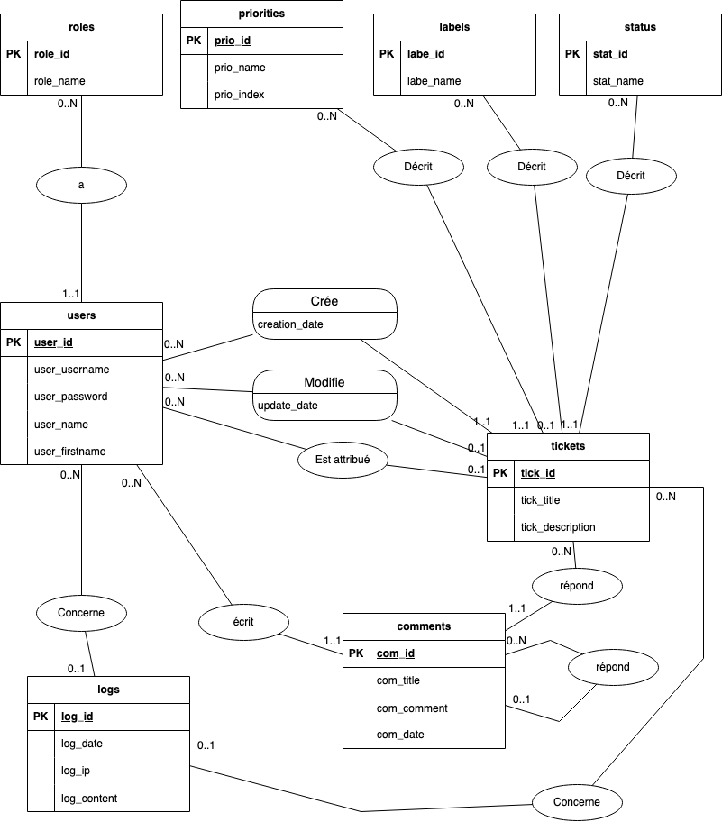

# CONCEPTION  

> FA2 | BARKER, OUALI, GUILLERAY, GRAVIER, LEMOUTON  

## Modèle de conception de base de données  

### Modèle relationnel  

  

### Modèle logique  

roles (__role_id__, role_name)  
priorities (__prio_id__, prio_name, prio_index)  
label (__labe_id__, labe_name)  
status (__stat_id__, stat_name)  
users (__user_id__, user_username, user_password, user_name, user_firstname, #role_id)  
ticket (__tick_id__, tick_title, tick_description, #author_id, #label_id, #priority_id, #status_id, #updater_id, date_creation, date_update)  
logs (__log_id__, log_date, log_ip, log_content, #tick_id, #user_id)  
comments (__com_id__, com_title, com_comment, com_date, #ticket_id, #user_id, #reply_to)  

## Diagramme de Classe

Pour créer le diagramme de classe, nous avons utilisé les tables données précédemment. Grâce aux liaisons entre elles,
nous avons pu les lier avec des associations.  

## Diagramme de Classe Détaillé

Afin de pouvoir commencer la programmation, nous avons détaillé les classes que nous avons besoin.  
Nous avons aussi détaillé les classes en renseignant les différents champs et les méthodes utiles au développement

> FA2 | BARKER, OUALI, GUILLERAY, GRAVIER, LEMOUTON  