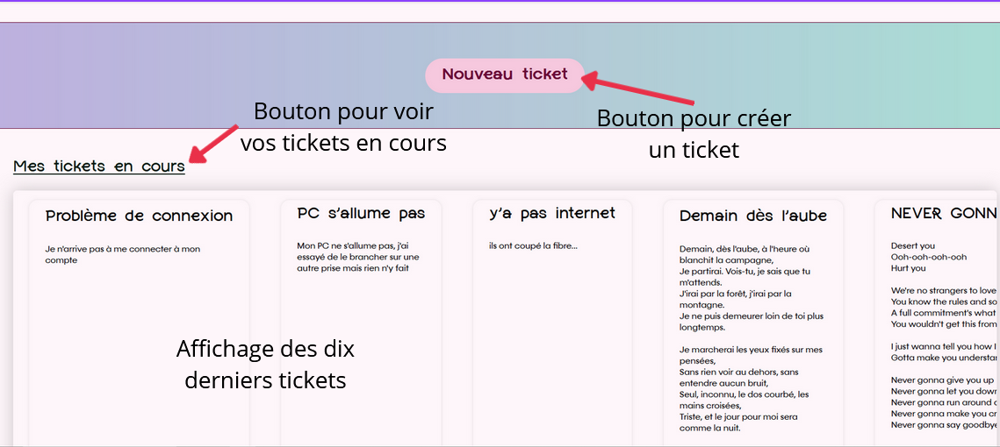

# Guide Utilisateur  

> FA2 | BARKER, OUALI, GUILLERAY, GRAVIER, LEMOUTON  

## Page d'accueil du site

À votre arrivée sur le site, vous pouvez découvrir dans la partie supérieure, différents onglets de navigation.  
De gauche à droite, sont répertoriés : 
- Un bouton pour vous rendre au menu principal du site au clic sur le logo Xilium ainsi qu'une vidéo 
explicative du site
- Un lot de trois onglets pour vous déplacer respectivement dans le tableau de bord, la FAQ et les informations 
de Xilium
- Un bouton pour voir les informations de votre profil
- Un bouton de connexion si vous n'êtes pas connecté

En défilant, vous pouvez créer des tickets et voir les dix derniers tickets.  
Pour voir, vos tickets en cours, il vous suffit de cliquer sur le bouton "Mes tickets en cours"

