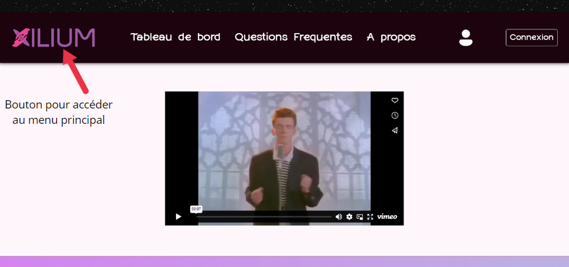

# Guide Utilisateur  

> FA2 | BARKER, OUALI, GUILLERAY, GRAVIER, LEMOUTON  

## Page d'accueil du site

À votre arrivée sur le site, vous pouvez découvrir dans la partie supérieure, différents onglets de navigation.  
De gauche à droite, sont répertoriés : 
- Un bouton pour se rendre au menu principal du site, situé dans le nom de l'application
- Un lot de trois onglets servant pour se déplacer respectivement dans le dashboard, la FAQ et les informations de Xilium 
- Un 

###  