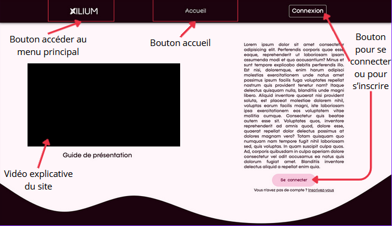
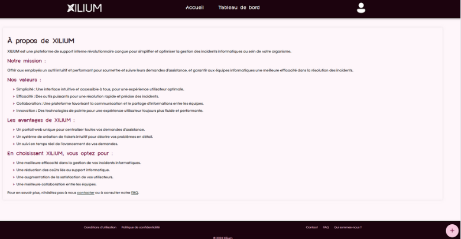
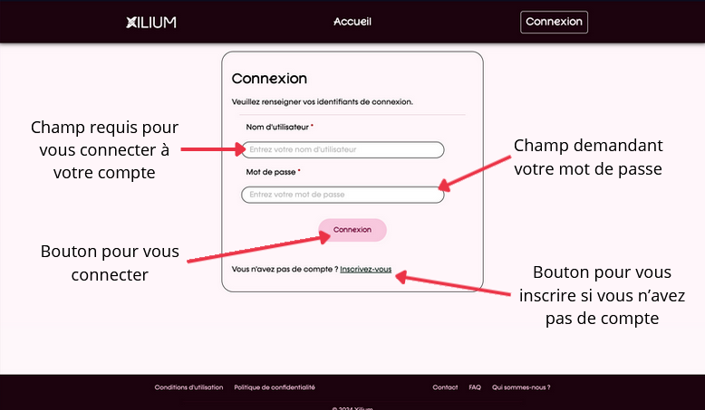
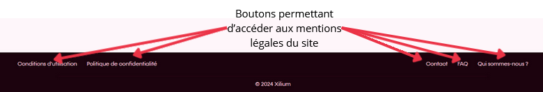

# Guide Utilisateur  

> FA2 | BARKER, OUALI, GUILLERAY, GRAVIER, LEMOUTON  

## Page d'accueil du site

À votre arrivée sur le site, vous pouvez découvrir dans la partie supérieure, différents onglets de navigation.  
De gauche à droite, sont répertoriés : 
- Un bouton pour vous rendre au menu principal du site au clic sur le logo Xilium ainsi qu'une vidéo 
explicative du site
- Un bouton accueil pour vous rendre à l'accueil du site
- Un bouton de connexion et d'inscription si vous n'êtes pas connecté

En défilant, vous pouvez créer des tickets et voir les dix derniers tickets.  
Pour voir, vos tickets en cours, il vous suffit de cliquer sur le bouton "Mes tickets".

## Page création de ticket

Voici la page de création des tickets. C'est ici que vous pourrez remplir 
votre ticket afin de signaler votre problème.  
Vous retrouverez de haut en bas :
- Un champ récupérant une courte description de votre problème
- Trois listes déroulantes pour choisir la catégorie, le type et le niveau d'urgence de votre problème
- Un champ vous permettant de décrire votre problème dans les moindres détails
- Un bouton pour valider l'envoi de votre ticket  

## Page de Tableau de bord

Dans cet onglet, vous retrouverez vos tickets personnels en cours et clos avec les 
réponses apportées par les techniciens.

## Page Questions Fréquentes

Cet onglet répertorie les questions les plus fréquentes, sous la forme d'une foire aux questions (FAQs).  
Il vous suffit de cliquer sur les questions pour voir la réponse s'afficher juste en dessous.  
Cette section vous permet de pouvoir répondre à une potentielle question sans devoir créer un ticket 
et de devoir attendre. 

## Page À propos

Sur cette page, vous retrouvez les valeurs de Xilium et nos objectifs. 

## Page compte

En cliquant sur le bonhomme, vous pourrez accéder à la modification de votre mot de passe
ainsi que la déconnexion. 

## Page de connexion 

Le bouton "connexion" vous permet de vous inscrire ou vous connecter à votre compte.

## Page d'inscription

En cliquant sur le bouton "inscrivez-vous" cela vous permet de vous inscrire 
et de renseigner vos informations de connexion.

## Mentions Légales

En bas de toutes les pages, vous retrouverez les mentions légales.

 

## Page de Tableau de bord Admin Web

Sur cette page, l'administrateur Web peut affecter des tickets à des techniciens afin de prendre en charge les 
problèmes des utilisateurs.   

## Page de log

Sur cette page, l'administrateur peut consulter les logs des modifications sur l'application qui sont découpées par semaine.
Il peut ainsi basculer de semaine en semaine grâce à la liste déroulante et en appuyant sur charger.

## Page de la gestion des users, labels et catégories

Sur cette page, l'administrateur web peut manipuler les utilisateurs, les labels ainsi que les 
catégories. Il peut en ajouter, en modifier et en supprimer.

  

  

> FA2 | BARKER, OUALI, GUILLERAY, GRAVIER, LEMOUTON  